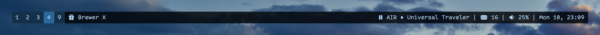

# ``bar``

Modular status bar for the Mac.

## Overview

*bar* draws a status bar on each screen connected at runtime.
The bar can be configured to have a specific ``Config-swift.enum/height``, ``Config-swift.enum/position``, and ``Config-swift.enum/background`` color.
You can also customize the ``Config-swift.enum/font`` and ``Config-swift.enum/foreground`` color used by all the texts.

Inside the bar, you can display one or more ``Block``, each defined by a name, placement, shell command, and optional refresh interval.
At runtime each block runs the command, reads from stdout, and builds one or more ``Cell`` from the output.
If you specify the interval, the block will re-run the command with such frequency.

## Topics

### Before you start

- <doc:how-it-works>

### Getting started

- <doc:installation>
- <doc:run-at-login>

### Customisation

- <doc:customisation>
- <doc:patches>
- ``Config``
- ``HEX``

### Bar

- <doc:screens>
- <doc:hide-show>

### Blocks

- <doc:command>
- <doc:refresh>
- <doc:highlighting>
- <doc:gestures>
- ``Block``
- ``Cell``

### Models

- ``Runner``
- ``Notifier``

### Views

- ``AppDelegate``
- ``Screen``
- ``BarWindow``
- ``BarView``
- ``BlockView``
- ``CellView``
